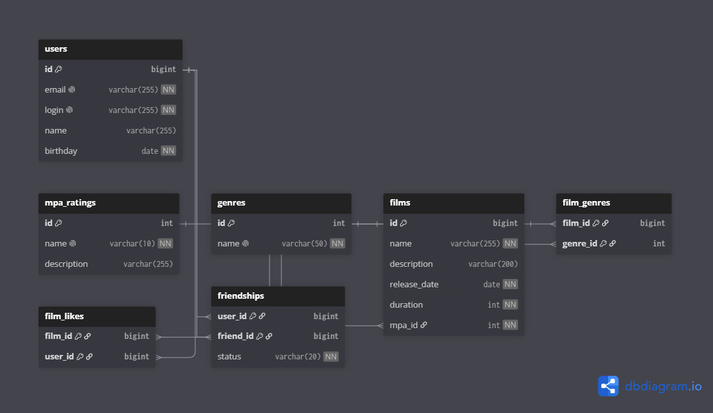

# 🎬 Filmorate

## Схема базы данных




---

## Описание таблиц

### 1. `users` (Пользователи)
Хранит основную информацию о пользователях сервиса.
* `id` (BIGINT, PK) — Уникальный идентификатор пользователя.
* `email` (VARCHAR) — Электронная почта (уникальна, обязательна).
* `login` (VARCHAR) — Логин пользователя (уникален, обязателен).
* `name` (VARCHAR) — Отображаемое имя (если не указано, используется логин).
* `birthday` (DATE) — Дата рождения пользователя.

### 2. `films` (Фильмы)
Хранит основную информацию о фильмах.
* `id` (BIGINT, PK) — Уникальный идентификатор фильма.
* `name` (VARCHAR) — Название фильма (обязательно).
* `description` (VARCHAR) — Описание фильма (макс. 200 символов).
* `release_date` (DATE) — Дата релиза (не может быть раньше 28 декабря 1895 года).
* `duration` (INT) — Продолжительность в минутах (положительное число).
* `mpa_id` (INT, FK) — Внешний ключ на рейтинг MPA.

### 3. `mpa_ratings` (Рейтинги MPA)
Справочник возрастных рейтингов (G, PG, PG-13, R, NC-17).
* `id` (INT, PK) — Идентификатор рейтинга.
* `name` (VARCHAR) — Название рейтинга.
* `description` (VARCHAR) — Расшифровка возрастного ограничения.

### 4. `genres` (Жанры)
Справочник жанров (Комедия, Драма, Боевик и т.д.).
* `id` (INT, PK) — Идентификатор жанра.
* `name` (VARCHAR) — Название жанра.

### 5. `film_genres` (Связь фильмов и жанров)
Промежуточная таблица для связи "Многие ко многим". 
* `film_id` (BIGINT, FK) — ID фильма.
* `genre_id` (INT, FK) — ID жанра.
* *(Составной первичный ключ: `film_id` + `genre_id`)*.

### 6. `film_likes` (Лайки фильмов)
Промежуточная таблица для хранения лайков пользователей.
* `film_id` (BIGINT, FK) — ID фильма, которому ставят лайк.
* `user_id` (BIGINT, FK) — ID пользователя, который ставит лайк.
* *(Составной первичный ключ: `film_id` + `user_id`)*.

### 7. `friendships` (Дружба между пользователями)
Таблица для отслеживания статуса дружбы.
* `user_id` (BIGINT, FK) — ID инициатора запроса.
* `friend_id` (BIGINT, FK) — ID получателя запроса.
* `status` (VARCHAR) — Статус дружбы (`PENDING` — неподтвержденная, `CONFIRMED` — подтвержденная).
* *(Составной первичный ключ: `user_id` + `friend_id`)*.

---

## Базовые SQL-запросы для бизнес-логики

### 1. Получить всех пользователей
```sql
SELECT *
FROM users;
```

### 2. Получить список друзей пользователя (подтверждённых)
```sql
SELECT u.* 
FROM users u
JOIN friendships f ON u.id = f.friend_id
WHERE f.user_id = 1 AND f.status = 'CONFIRMED';
```

### 3. Найти общих друзей двух пользователей
```sql
SELECT u.*
FROM users u
JOIN friendships f1 ON u.id = f1.friend_id
JOIN friendships f2 ON u.id = f2.friend_id
WHERE f1.user_id = 1 AND f2.user_id = 2
  AND f1.status = 'CONFIRMED' AND f2.status = 'CONFIRMED';
```

### 4. Получить топ-10 популярных фильмов
```sql
SELECT f.id, f.name, COUNT(l.user_id) AS likes_count
FROM films f
LEFT JOIN film_likes l ON f.id = l.film_id
GROUP BY f.id, f.name
ORDER BY likes_count DESC
LIMIT 10;
```